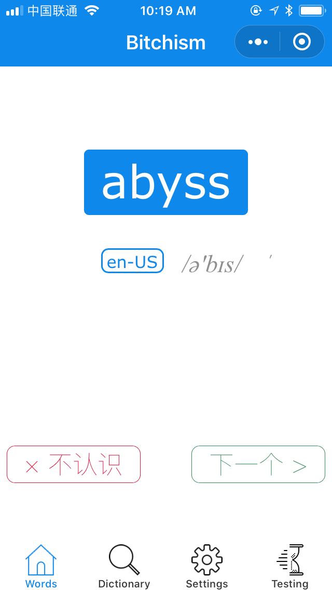
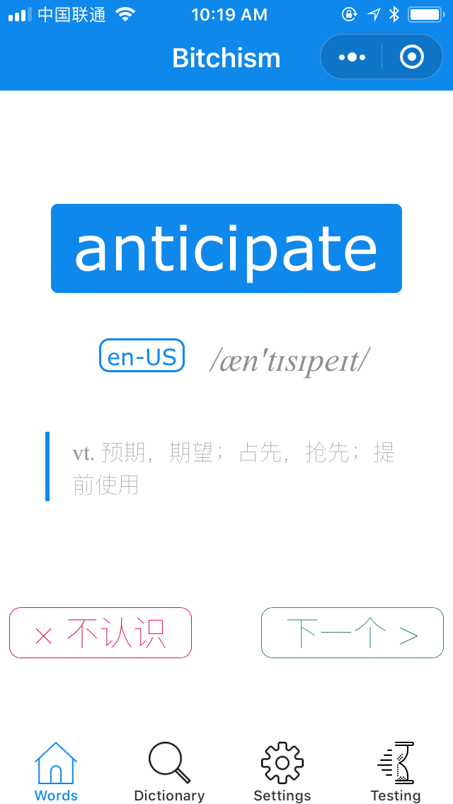
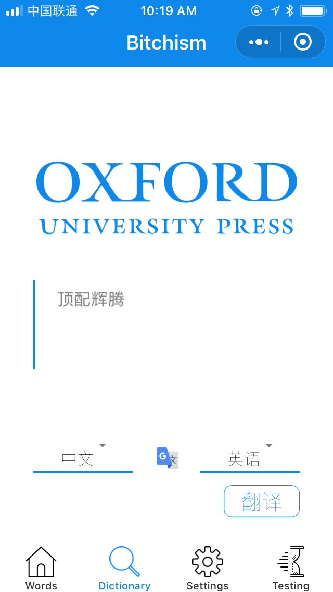
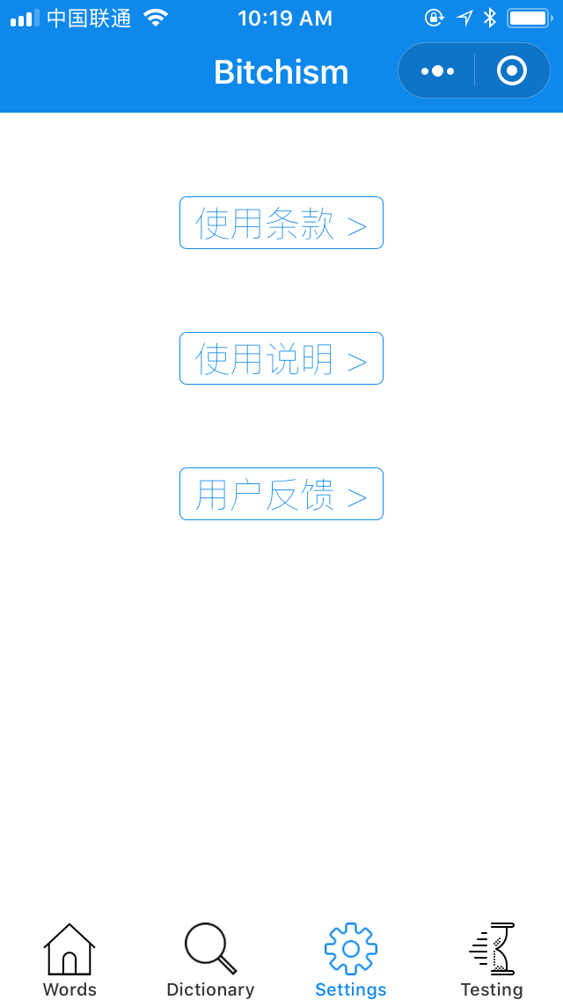
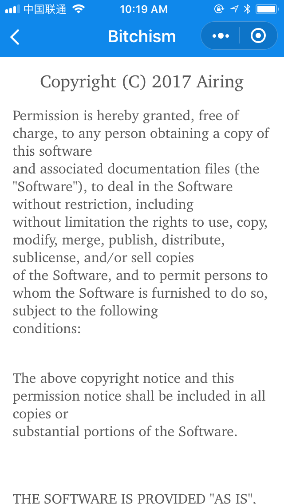
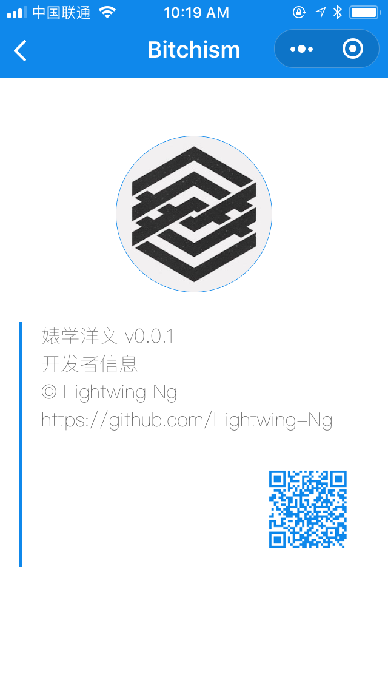
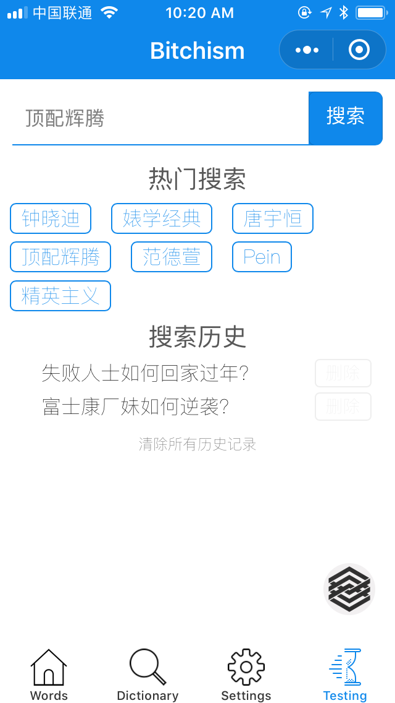

# Bitchism-master
## 功能简介
```
练手项目，实现：
JSON序列化
搜狗翻译API调用
搜索功能
```
## 工程目录
```
.
├── .DS_Store
├── .git
│   ├── HEAD
│   ├── branches
│   ├── config
│   ├── description
│   ├── hooks
│   │   ├── applypatch-msg.sample
│   │   ├── commit-msg.sample
│   │   ├── fsmonitor-watchman.sample
│   │   ├── post-update.sample
│   │   ├── pre-applypatch.sample
│   │   ├── pre-commit.sample
│   │   ├── pre-push.sample
│   │   ├── pre-rebase.sample
│   │   ├── pre-receive.sample
│   │   ├── prepare-commit-msg.sample
│   │   └── update.sample
│   ├── index
│   ├── info
│   │   └── exclude
│   ├── objects
│   │   ├── cb
│   │   │   └── fba961cceaf3a981ddc386754d569cc7db2a55
│   │   ├── info
│   │   └── pack
│   └── refs
│       ├── heads
│       └── tags
├── .idea
│   ├── inspectionProfiles
│   │   └── profiles_settings.xml
│   ├── misc.xml
│   ├── modules.xml
│   ├── workspace.xml
│   └── ?\215?\203\214?\215\225?\215.iml
├── README.md                   # 说明文档
├── app.js
├── app.json                    # 项目配置
├── app.wxss
├── assets
│   ├── .DS_Store
│   ├── ScreenShot
│   │   ├── ?\215\225?\215.png
│   │   ├── ?\217\215?\210页.png
│   │   ├── ?\212学?\217?\205??\213?\225页.png
│   │   ├── ?\200?\217\221?\200\205信?\201?.png
│   │   ├── 翻?\221.png
│   │   ├── 设置页?\235?.png
│   │   ├── 软件使?\224??\215\217议.png
│   │   └── ?\207\212?\211.png
│   └── font
│       └── .DS_Store
├── data                        # 单词数据
│   ├── vocabulary.js
│   └── word-list.js
├── images                      # 图标
│   ├── .DS_Store
│   ├── Google_Translate_logo.png
│   ├── OxfordDictionary.png
│   ├── QRCode_LightwingNg.png
│   ├── home-selected.png
│   ├── home.png
│   ├── line.png
│   ├── logo.png
│   ├── more-selected.png
│   ├── more.png
│   ├── search-selected.png
│   ├── search.png
│   ├── settings-selected.png
│   └── settings.png
├── pages                       # 页面
│   ├── index
│   │   ├── index.js
│   │   ├── index.json
│   │   ├── index.wxml
│   │   └── index.wxss
│   ├── search                  # 翻译页
│   │   ├── detail              # 开发者信息
│   │   │   ├── detail.js
│   │   │   ├── detail.json
│   │   │   ├── detail.wxml
│   │   │   └── detail.wxss
│   │   ├── search.js           # 翻译
│   │   ├── search.json
│   │   ├── search.wxml
│   │   └── search.wxss
│   ├── settings                # 设置
│   │   ├── clause              # 使用条款
│   │   │   ├── clause.js
│   │   │   ├── clause.json
│   │   │   ├── clause.wxml
│   │   │   └── clause.wxss
│   │   ├── feedback            # 反馈
│   │   │   ├── feedback.js
│   │   │   ├── feedback.json
│   │   │   ├── feedback.wxml
│   │   │   └── feedback.wxss
│   │   ├── help                # 使用帮助
│   │   │   ├── help.js
│   │   │   ├── help.json
│   │   │   ├── help.wxml
│   │   │   └── help.wxss
│   │   ├── settings.js
│   │   ├── settings.json
│   │   ├── settings.wxml
│   │   └── settings.wxss
│   ├── testing                 # 婊学页面调试
│   │   ├── testing.js
│   │   ├── testing.json
│   │   ├── testing.wxml
│   │   └── testing.wxss
│   └── word                    # 背单词
│       ├── word.js
│       ├── word.json
│       ├── word.wxml
│       └── word.wxss
├── project.config.json         # 工程配置
├── utils
│   ├── hotapp-conf.js
│   ├── hotapp.js
│   └── wilddog-weapp-all.js
└── wxSearch
    ├── wxSearch.js
    ├── wxSearch.wxml
    └── wxSearch.wxss
```
## 安装
```Shell
install
```
## 产品截图

<center>记单词</center>

<center>查看释义</center>

<center>翻译</center>

<center>设置入口</center>

<center>软件使用协议</center>

<center>开发者</center>

<center>婊学经典</center>


